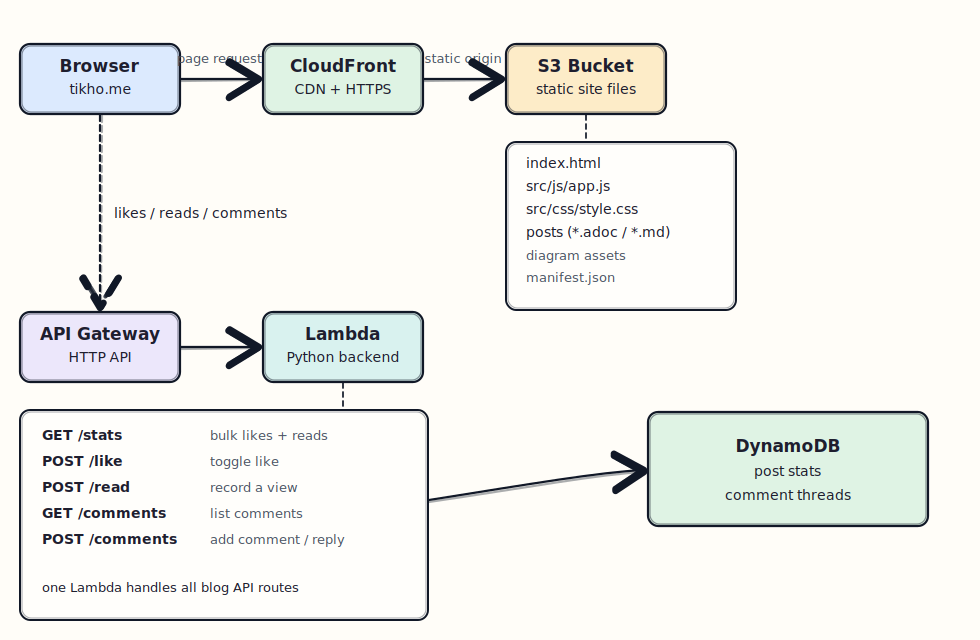
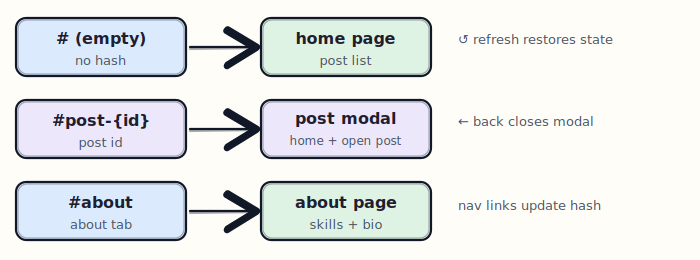
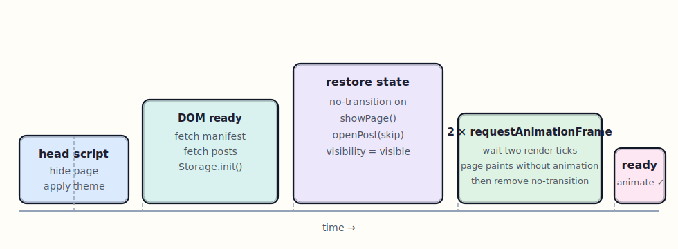
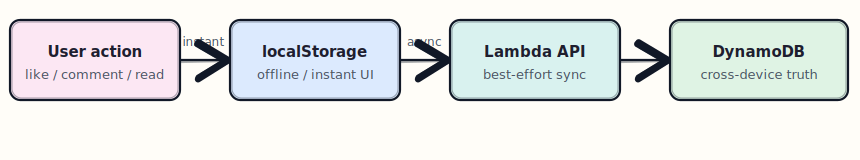
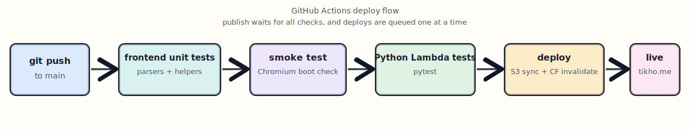

= Building tikho.me — a static blog with no framework

I wanted a personal blog that felt like software, not a publishing stack.
No theme engine to fight, no build pipeline to babysit, no framework abstractions between me and the page.
Just static files, a bit of JavaScript, and enough backend to support the small things that make a blog feel alive.

That became `tikho.me`: a static frontend on S3 + CloudFront, posts stored as plain files, and a small serverless backend for likes, reads and comments.
This post explains how it is put together, which problems came up, and what changed as the site slowly became a real project instead of a weekend experiment.
The full source is on https://github.com/atsikham/blog[GitHub].

== Architecture

The site is a single-page app served from S3 + CloudFront.
Posts live in `src/posts/` as Markdown or AsciiDoc files.
A Python Lambda behind API Gateway handles engagement data, and DynamoDB stores aggregate counts plus threaded comments.

At runtime, the frontend fetches `src/posts/manifest.json` for metadata and then fetches the matching post file when it needs content.
That keeps authoring simple: adding a post means creating a text file and adding one metadata entry.

There is no frontend build step.
The only packaging step in the whole project is building the Lambda zip for deployment.

== Writing posts

Posts are plain text files under `src/posts/`.
The manifest holds metadata like title, date, authors, excerpt and tags.

Both Markdown and AsciiDoc are supported.
The parser picks the right format from the file extension, so there is no config to change when writing.
AsciiDoc is handy for long technical posts because admonitions, code blocks and diagrams fit naturally.

Read time is calculated from the post word count automatically.
That keeps metadata smaller and avoids the usual problem where the stored read time quietly drifts out of date.

== Routing and URL state

The app stores page state in the URL hash.
`#about` opens the about page.
`#post-1` opens a specific post.
An empty hash shows the home feed.

That gives a few nice properties for almost no code:

* refreshing keeps you on the same post
* the back button naturally closes an open modal
* there is no router library involved

It is a small feature, but it makes the site feel much more solid than a purely in-memory modal state.

== Fixing the refresh flash

One of the ugliest problems early on was refresh behaviour with a post already open.
The page would flash through several half-rendered states before settling down.

There were three separate causes.

First, content briefly rendered before the right theme and layout state were applied.
The fix was a tiny inline script in `<head>` that hides the page and applies the saved theme before the first paint.
That same choice also prevents the dark/light theme from flashing on load.

Second, the modal animation was firing during restore.
That made a restored post look like it was being opened from scratch.
The fix was a temporary `no-transition` class that disables transitions just for the restore cycle.
The class is removed only after two `requestAnimationFrame` ticks, which gives the browser time to paint the restored state once before animations are enabled again.

Third, restoring the hash could re-trigger the hash listener and cause a second open call.
The fix was a small guard flag so the app can tell which hash changes it initiated itself.

None of these fixes is especially complicated on its own.
The annoying part was that all three showed up as one visible flicker.

== Engagement features

Every post shows likes and reads.
The server stores aggregate counts.
The browser stores whether this browser has liked a post.
That keeps the backend simple while still giving the user immediate feedback.

Large counts are formatted compactly: `1.2k`, `10k`, `10m`.
Reads are only recorded once per browser session, so refreshing the same post does not inflate the counter.

=== Comments and replies

Comments are threaded.
A comment can reply to another comment, and replies can nest as deep as needed.
Each thread can be collapsed or expanded so long discussions do not overwhelm the post.

When you click Reply, the form shows who you are replying to.
Replies render under their parent with visible indentation and thread structure.

=== Storage strategy

Engagement data uses a two-layer approach.

`localStorage` is written first, so the UI updates immediately.
Then the Lambda API syncs in the background.
If the backend is unavailable, the site still behaves sensibly in local-only mode.

That fallback matters for a personal site.
The blog should still be readable and interactive even if the API layer is temporarily unavailable.

== Tag filtering, search and the About page

Tags come from `src/posts/manifest.json`.
The home page supports multi-tag filtering with AND logic, so selecting two tags narrows the result to posts containing both.
Search matches titles, excerpts, tags and author names.

The About page is driven by the posts too.
Its “Most Written About” section is derived from the most frequent tags across all posts.
That means the About page updates naturally as the writing changes.

There is also a global exclusion list in the manifest for tags that are useful on posts but not useful as “skills” on the About page.
Right now `JavaScript` is excluded there for exactly that reason.

== Light and dark theme

The theme system is deliberately simple.
All colours come from CSS custom properties, so switching theme is just a `data-theme` change on `<html>`.

The toggle exists both in the page header and inside the post modal.
The chosen theme is saved locally and applied before first paint, which keeps the experience stable on refresh.

== PDF export

Each post can be exported as a PDF.
There is no server-side render step and no external PDF library involved.
The site opens a print-friendly version of the post in a new tab and relies on print CSS plus `window.print()`.

That keeps the implementation small while still making posts portable when someone wants to save or share a copy.

== Tests and guarding against regressions

There are two layers of tests in the repo.

Frontend unit tests cover the pure logic:

* Markdown and AsciiDoc parsing
* count formatting
* comment tree behaviour and migration logic

A separate browser smoke test loads the real site in Chromium and checks that the home page, About page and post modal still work.

That second layer ended up being especially important.
A static site can fail in a very boring way: one missing helper or one startup exception and suddenly the whole page is blank.
The smoke test exists to catch exactly that kind of regression.

The backend has its own Python `pytest` suite.
The Lambda tests cover routing, JSON parsing, sanitizing comment input, likes, reads, comments and reply handling.

== Infrastructure and deploy

Everything lives in Terraform.
That includes:

* S3 for static hosting
* CloudFront in front of it
* API Gateway
* a Python Lambda
* DynamoDB for stats and comments

Terraform also renders `src/js/config.js` from a template, so the deployed site always gets the correct API URL automatically.

GitHub Actions runs three checks on every push:

* frontend unit tests
* browser smoke test
* Python Lambda tests

Deploys from `main` are serialized, so only one publish runs at a time.
Terraform state is also locked remotely, which avoids the usual race conditions around concurrent infra changes.

The frontend still has no build step.
The only packaging step is the Lambda zip, which is assembled from `lambda/index.py` plus its Python dependencies before `terraform apply`.

== Why it ended up this way

This project is opinionated in a quiet way.
It prefers plain files over tooling, small moving parts over convenience layers, and a little bit of handwritten code over a lot of generated structure.

That does not make it the right answer for every site.
But for a personal blog, it has been a good trade.
The content stays close to the code, the deployment story is understandable, and the whole thing is small enough that fixing a weird edge case still feels manageable.

That was the real goal from the start.
The real goal was a system compact enough that I could still see how all of its pieces fit together.
