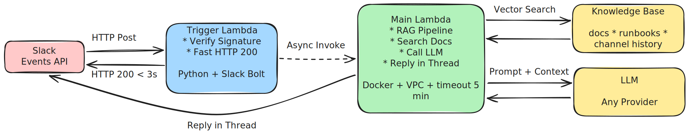
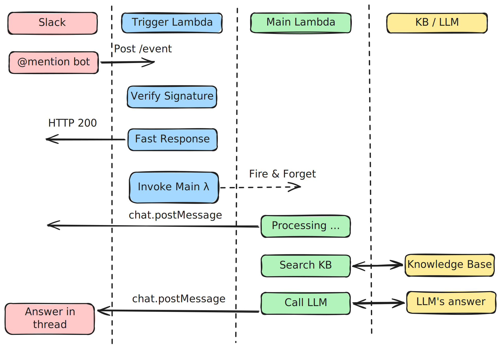

= Ask the bot, skip the ticket — RAG-powered Slack assistant on AWS Lambda

== The Idea

Most teams have decent documentation, but it often goes unread.
Support questions accumulate in Slack — frequently the same ones — and the engineers who can answer them get pulled into it regularly.

This post describes a concept for a Slack bot that helps with that.
When someone mentions the bot in a channel, it searches the docs for relevant content, feeds it to an LLM, and replies in the same thread — automatically, with no servers to manage.

== The tricky part: Slack's 3-second rule

Here's the catch with Slack bots: Slack expects your server to respond within **3 seconds**, or it assumes something went wrong and retries the request.
That's fine for simple bots, but searching a knowledge base and calling an LLM easily takes 10–30 seconds.
If you try to do it all in one shot, Slack retries, and you end up processing the same message multiple times.

The solution is two Lambda functions instead of one:

[cols="1,2"]
|===
| Lambda | What it does

| *Trigger*
| Receives the Slack event, checks the signature to make sure it's legit, fires off a quick "got it" reply to Slack, then hands the work off to the second Lambda — all within 3 seconds.

| *Main*
| Does the actual work: searches the docs, calls the LLM, posts the answer back to the user's thread. Takes as long as it needs — up to 5 minutes.
|===

The trigger Lambda also passes along how many times Slack has retried the request.
The main Lambda ignores anything that's a retry, so even if Slack sends the same event four times, the user only ever gets one answer.

== How a message flows through the system

. User mentions the bot in a Slack channel.
. Slack POSTs the event to the trigger Lambda's URL.
. Trigger verifies the request signature and immediately returns HTTP 200 — Slack is happy.
. Trigger asynchronously invokes the main Lambda (fire and forget).
. Main Lambda sends a quick "processing…" message to the thread so the user knows something is happening.
. It searches the knowledge base for content relevant to the question.
. It passes the question plus the retrieved docs to the LLM.
. LLM generates an answer; main Lambda posts it to the original thread.

== The trigger Lambda

The trigger uses https://tools.slack.dev/bolt-python/[slack-bolt] to handle the Slack handshake and signature verification automatically.
There's not much code here — that's the point.

[source,python]
----
app = App(
    process_before_response=True,
    signing_secret=os.getenv("SLACK_SIGNING_SECRET"),
    token=os.getenv("SLACK_BOT_TOKEN"),
)

@app.event("message")
def handle_message(event, say):
    if not is_app_mentioned(event):
        return
    lambda_client = boto3.client("lambda")
    event["retry_num"] = retry_num
    lambda_client.invoke(
        FunctionName=os.getenv("MAIN_LAMBDA_ARN"),
        InvocationType="Event",   # async — doesn't wait for a response
        Payload=json.dumps(event),
    )
----

`process_before_response=True` makes slack-bolt run the handler before sending the HTTP response back — that's what enables the async invoke while still replying to Slack in time.

== The main Lambda

The main Lambda does three things: strip the bot mention from the question, search the docs, ask the LLM.

[source,python]
----
def lambda_handler(event, context):
    if int(event.get("retry_num")) == 0:
        send_text_response(event, "Your request is being processed. Please wait...")
        try:
            rag = build_rag(SYSTEM_PROMPT, retriever_cls=KnowledgeBaseRetriever)
            message = rag.invoke(remove_mentions(event.get("text"), event.get("user")))
        except Exception as e:
            send_text_response(event, "Something went wrong, please try again.")
            return {"statusCode": 200, "body": "OK"}
        send_text_response(event, message)
    return {"statusCode": 200, "body": "OK"}
----

The RAG pipeline:

. Cleans up the question — removes the `@botId` mention that Slack injects.
. Searches the knowledge base using vector similarity — finds the docs most relevant to what the user asked.
. Sends the question along with those docs to the LLM as context.
. Posts the answer back to the Slack thread.

It runs inside a VPC so it can reach internal services.
It's packaged as a Docker image.

== Infrastructure decisions

A few choices worth explaining:

*Lambda Function URL instead of API Gateway* — The trigger Lambda has a direct HTTPS URL.
No API Gateway, no extra config, lower cost for a single endpoint.
CORS is locked to `api.slack.com` so only Slack can hit it.

*Least-privilege IAM* — The trigger role can only write logs and invoke the main Lambda.
The main role can only write logs and manage its own network interfaces.
Nothing broader.

*Retries disabled on both Lambdas* — Lambda has its own retry logic for async invocations.
It's turned off (`maximum_retry_attempts = 0`) because Slack retries are already handled in application code.
Letting Lambda retry on top of that would cause duplicates.

*CloudWatch logs, 30-day retention* — Simple, standard, and enough to debug anything that goes wrong.

== What goes in the knowledge base

The bot is only as good as what it can search.
Good sources to index:

* Official platform or product documentation.
* Internal runbooks and troubleshooting guides.
* Relevant Slack channel history — questions and answers from the team often contain knowledge that hasn't made it into the formal docs yet.

The knowledge base is pre-indexed and the bot queries it at runtime using vector search — no re-indexing on every message.

== Summary

This is a fairly straightforward architecture once the two-Lambda split clicks.
The trigger stays small and fast, the main Lambda does the heavier work without time pressure, and Slack's retry behaviour is handled cleanly in application code.

The end result: a bot that answers platform questions in Slack, reduces repetitive support load, and runs on managed infrastructure with no servers to operate.
