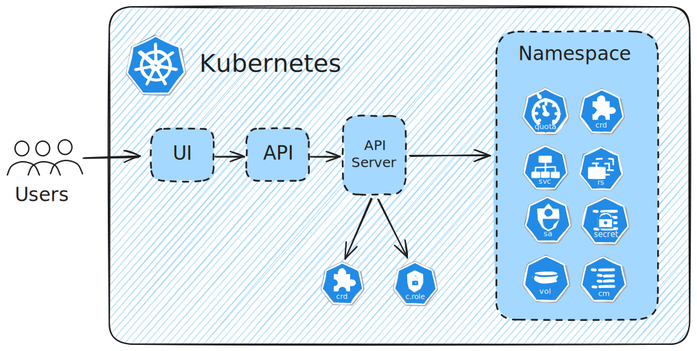
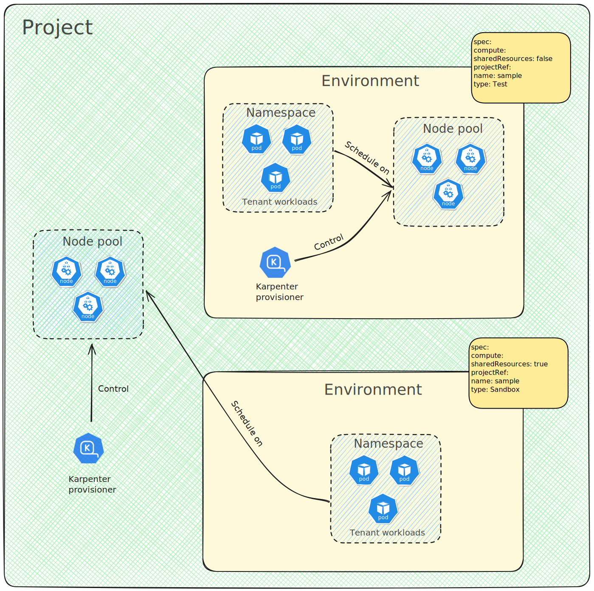
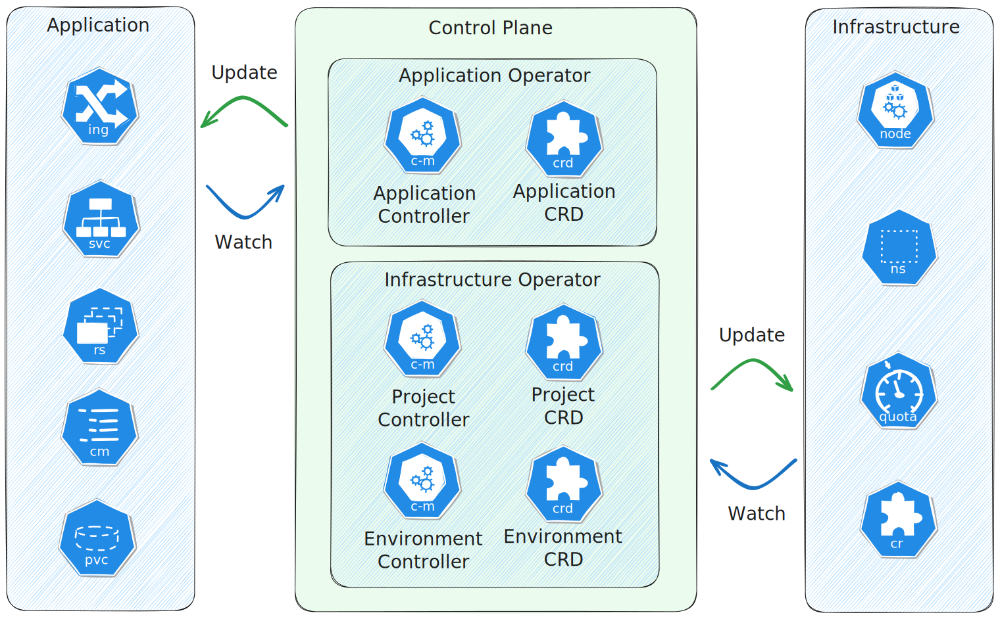
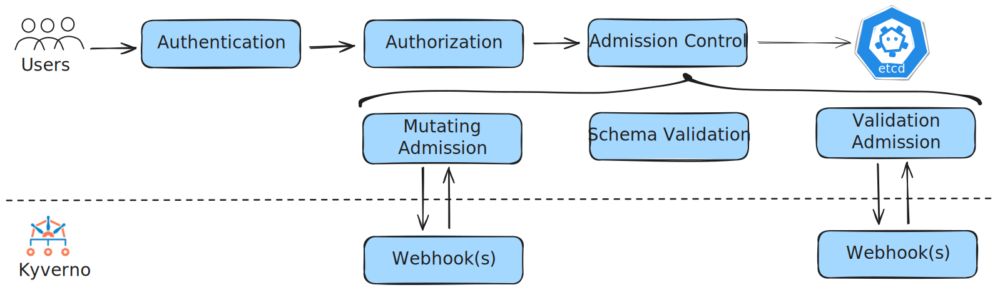

= Building a self-service platform on Kubernetes with Operators, Karpenter and Kyverno

== Introduction

Kubernetes has become the go-to platform for running workloads at scale, and more and more teams are building internal developer platforms on top of it.
But there's a catch — there's no widely agreed-upon way to do it well.
Every organisation ends up solving the same problems from scratch: how do you give teams self-service access without drowning in manual work? How do you keep workloads isolated? How do you stay consistent as the platform grows?

This post proposes a possible approach to these challenges using a custom Kubernetes operator, Karpenter, and Kyverno.

== The problem

A self-service platform lets teams spin up and manage their own environments without needing to file a ticket or wait for a platform engineer.
Getting that right is harder than it sounds. The main challenges are:

* Building an abstraction layer that doesn't leak cloud-specific details — teams shouldn't need to know whether they're on AWS, GCP, or anything else.
* Keeping workloads isolated so one team's noisy neighbour can't affect another.
* Making sure metadata — who owns what, what environments exist, what the limits are — is consistent and accessible in one place.

== Concept

The core idea is to split platform concerns into two kinds of operators: an application operator and one or more infrastructure operators.

The application operator handles everything about the app itself — deployments, scaling, restarts.
The infrastructure operator handles the platform plumbing — namespaces, resource quotas, network policies, and compute provisioning.

This split keeps things clean.
App teams can focus on their workloads, and platform teams manage the underlying infrastructure without stepping on each other.

Each application should get its own Kubernetes namespace.
Sharing a namespace between multiple applications causes more problems than it solves:

* Resource contention: One app spiking on CPU or memory can starve others in the same namespace.
* Security risk: A compromised app could affect neighbours sharing the same access controls.
* Weak isolation: Network policies and service accounts are namespace-scoped, so sharing a namespace means sharing boundaries.
* Harder debugging: Logs and metrics from multiple apps get mixed together, making it much harder to find the source of a problem.
* Risky updates: Updating one app can unintentionally disrupt others in the same namespace.

Giving each app its own namespace solves all of this cleanly.

== Implementation

The suggested solution is built around a custom Kubernetes operator — the project operator — that manages two resource types: `Project` and `Environment`.

Teams are organised into projects. Each project can have multiple environments, each backed by a Kubernetes namespace.
When a team creates an `Environment` resource, the operator automatically provisions a dedicated node pool using Karpenter and sets up the right policies using Kyverno.
This gives teams isolated compute and consistent guardrails without any manual steps from the platform side.

A `Project` resource could look like this:

[source,yaml]
----
apiVersion: platform.example.com/v1alpha1
kind: Project
metadata:
  name: sample-project
spec:
  contactInfo:
    - email: product.owner@example.com
      type: BusinessContact
    - email: finance.team@example.com
      type: BillingContact
    - email: platform-team@example.com
      type: TechnicalContact
    - email: security@example.com
      type: SecurityContact
  description: Sample project
  ownerEmail: platform-team@example.com
  quotas:
    - limit: 1
      type: Production
    - limit: 3
      type: Test
    - limit: 2
      type: Staging
    - limit: 2
      type: QA
    - limit: 5
      type: Development
    - limit: 5
      type: Sandbox
----

The `Project` resource acts as the single source of truth for a team — who to contact, and how many environments of each type they're allowed to create.
Each project gets a shared Karpenter `NodePool` with a taint (`projects.platform.example.com/node-pool`) so that only workloads belonging to that team can be scheduled onto those nodes.

A quick note on Karpenter: it's an open-source autoscaler for Kubernetes that replaces the traditional node group model.
Instead of pre-defining node groups, Karpenter watches for unschedulable pods and spins up exactly the right nodes for them — then removes those nodes when they're no longer needed.
This makes it much more efficient and cheaper to run.

An `Environment` resource could look like this:

[source,yaml]
----
apiVersion: platform.example.com/v1alpha1
kind: Environment
metadata:
  name: sample-project
spec:
  compute:
    capacity: onDemand
    nodeProvisioner: Karpenter
    sharedResources: false
  projectRef:
    name: sample-project
  type: Sandbox
----

`sharedResources: false` means this environment gets dedicated nodes rather than sharing them with other environments.
`capacity` controls whether those nodes are on-demand or spot instances.

When an environment is created with dedicated nodes, the following resources should be created automatically:

* A Karpenter `NodePool` and `EC2NodeClass` scoped to that environment.
* A Kubernetes namespace for the environment's workloads.
* A `NoSchedule` taint on the node pool (`environments.platform.example.com/node-pool`) so only that environment's pods land on those nodes.

The `EC2NodeClass` and `NodePool` resources would look like this:

[source,yaml]
----
apiVersion: karpenter.k8s.aws/v1
kind: EC2NodeClass
metadata:
  labels:
    app.kubernetes.io/managed-by: project-operator
  name: project-operator-default
spec:
  amiSelectorTerms:
    - alias: al2023@latest
  blockDeviceMappings:
    - deviceName: /dev/xvda
      ebs:
        deleteOnTermination: true
        encrypted: true
        volumeSize: 50Gi
        volumeType: gp3
  securityGroupSelectorTerms:
    - tags:
        karpenter.sh/discovery: dev-eu-west-1-app-01
  subnetSelectorTerms:
    - tags:
        kubernetes.io/cluster/dev-eu-west-1-app-01: shared
  tags:
    karpenter.sh/discovery: dev-eu-west-1-app-01
----

[source,yaml]
----
apiVersion: karpenter.sh/v1
kind: NodePool
metadata:
  labels:
    app.kubernetes.io/component: environment
    app.kubernetes.io/instance: sample
    app.kubernetes.io/managed-by: project-operator
    app.kubernetes.io/part-of: environment
    platform.example.com/project: example
    kyverno.platform.example.com/tenant-workload: "true"
  name: project-operator-environment-sample
spec:
  template:
    metadata:
      labels:
        environments.platform.example.com/node-pool: sample
        kyverno.platform.example.com/tenant-workload: "true"
    spec:
      nodeClassRef:
        group: karpenter.k8s.aws
        kind: EC2NodeClass
        name: project-operator-default
      requirements:
        - key: karpenter.sh/capacity-type
          operator: In
          values:
            - on-demand
        - key: karpenter.k8s.aws/instance-family
          operator: In
          values:
            - m6i
        - key: kubernetes.io/os
          operator: In
          values:
            - linux
        - key: kubernetes.io/arch
          operator: In
          values:
            - amd64
      taints:
        - effect: NoSchedule
          key: environments.platform.example.com/node-pool
          value: sample
  disruption:
    consolidationPolicy: WhenEmptyOrUnderutilized
    consolidateAfter: 30m
----

There's one more thing to solve: the nodes have a taint, but pods don't automatically know to tolerate it.
Forcing developers to manually add tolerations and node selectors to every pod spec would be error-prone and tedious.
Kyverno can take care of this transparently.

Kyverno is a policy engine for Kubernetes that can validate and mutate resources at admission time.
Two things make it a good fit here:

* Policies are just Kubernetes resources — no new language to learn.
* Mutations can read from the incoming request, so the policy can dynamically inject the right values.

The idea is for the operator to create a Kyverno `Policy` in each environment's namespace that automatically patches every pod with three things:

* The right labels to identify it as a tenant workload.
* A `nodeSelector` pointing to the environment's node pool.
* Tolerations so the pod can land on the tainted nodes.

Developers just deploy their workloads normally — the policy handles the rest behind the scenes.

[source,yaml]
----
apiVersion: kyverno.io/v1
kind: Policy
metadata:
  labels:
    app.kubernetes.io/component: environment
    app.kubernetes.io/instance: sample
    app.kubernetes.io/managed-by: project-operator
    app.kubernetes.io/part-of: environment
    platform.example.com/project: example
  name: default-pod-mutation
  namespace: sample
spec:
  background: true
  rules:
    - match:
        any:
          - resources:
              kinds:
                - Pod
      mutate:
        patchStrategicMerge:
          metadata:
            labels:
              kyverno.platform.example.com/tenant-workload: "true"
              environments.platform.example.com/node-pool: sample
      name: label
    - match:
        any:
          - resources:
              kinds:
                - Pod
      mutate:
        patchStrategicMerge:
          spec:
            nodeSelector:
              environments.platform.example.com/node-pool: sample
      name: nodeselector
    - match:
        any:
          - resources:
              kinds:
                - Pod
              selector:
                matchLabels:
                  kyverno.platform.example.com/tenant-workload: "true"
      mutate:
        patchesJson6902: |-
          [
            {
              "op": "add",
              "path": "/spec/tolerations/-",
              "value": {
                "effect": "NoSchedule",
                "key": "environments.platform.example.com/node-pool",
                "operator": "Equal",
                "value": "sample"
              }
            },
            {
              "op": "add",
              "path": "/spec/tolerations/-",
              "value": {
                "effect": "NoExecute",
                "key": "environments.platform.example.com/node-pool",
                "operator": "Equal",
                "value": "sample"
              }
            }
          ]
      name: toleration
  validationFailureAction: Enforce
----

== Conclusion

This post outlined a concept for building a self-service platform on Kubernetes using a custom operator, Karpenter, and Kyverno.
The idea is to give teams isolated environments on demand, with automatic node provisioning and pod scheduling — without any manual intervention from platform engineers.

While the example is AWS-specific, the concept isn't tied to any particular cloud.
The same pattern — custom CRDs, a node provisioner, and a policy engine — can work with other infrastructure tools as well.
