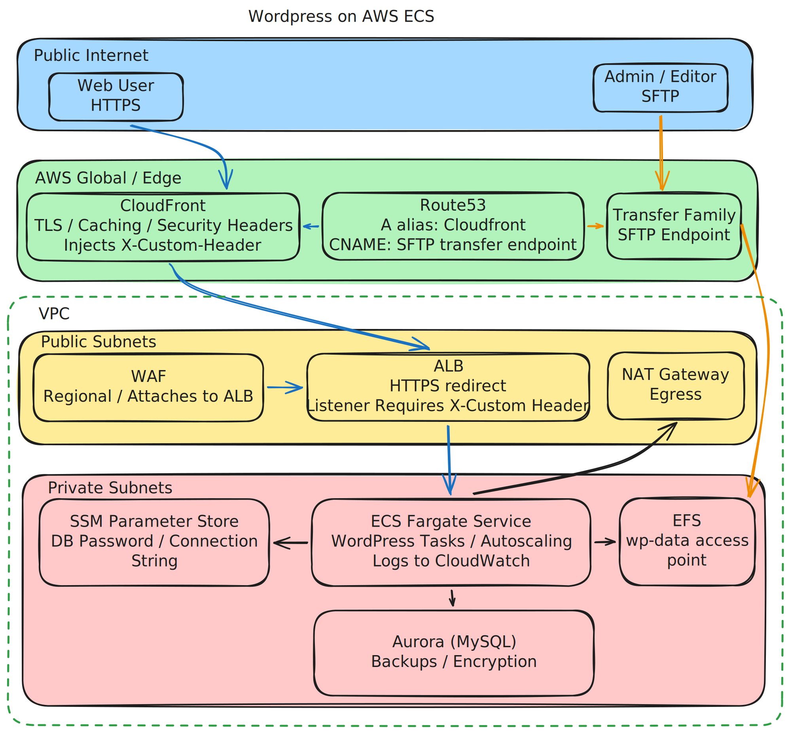

= Running WordPress on AWS ECS Fargate

Back in 2022–2023 I worked on a project where one of the tasks was moving a WordPress site
into AWS — properly automated, with no manual steps.
This is a write-up of how I built it, using Terraform from start to finish.

== Architecture

The stack:

* *ECS Fargate* — WordPress containers, autoscaling
* *Aurora (MySQL)* — managed database
* *EFS* — persistent storage for WordPress files, mounted by every container
* *ALB* — HTTPS termination, sits behind CloudFront
* *CloudFront* — CDN, caching, security headers, geo restriction
* *AWS WAF* with https://docs.aws.amazon.com/waf/latest/developerguide/aws-managed-rule-groups-use-case.html#aws-managed-rule-groups-use-case-wordpress-app[AWSManagedRulesWordPressRuleSet] — attached to ALB, blocks common WordPress attack patterns
* *AWS Transfer Family* — SFTP endpoint so editors can upload files directly to EFS
* *SSM Parameter Store* — secrets store
* *Route 53* — DNS, managed in a separate AWS account

== Providers and Cross-Account DNS

Route 53 lives in a separate AWS account. Two providers are configured — one for the main
account and one that assumes a role in the DNS account:

[source,hcl]
----
provider "aws" {
  region = var.region
  default_tags { tags = local.tags }
}

provider "aws" {
  alias  = "dns"
  region = var.region

  assume_role {
    role_arn = "arn:aws:iam::${local.route53_account}:role/terraform-automation"
  }
}
----

The `tls-certificate`, `cloudfront`, and `sftp` modules all take `aws.dns` as an explicit
provider, so DNS records and ACM validation are created automatically without any manual steps.

== Module Structure

Everything is a Terraform module — no loose resources at the top level:

----
terraform/
├── main.tf           # module calls + random_password for custom header
├── provider.tf       # two providers: main + cross-account dns
├── locals.tf         # posix UID/GID, tags
├── variables.tf      # name, region, domain, hosted_zone, ssm path
├── data.tf           # SSM parameter read, caller identity
└── modules/
    ├── network/
    ├── ecs-cluster/
    ├── ecs-app/      # task definition, service, ALB rules, autoscaling
    ├── database/     # Aurora, SSM connection string output
    ├── efs/          # filesystem, mount targets, access point
    ├── alb/
    ├── cloudfront/
    ├── tls-certificate/
    ├── sftp/
    └── waf/
----

The root `locals.tf` keeps shared values in one place:

[source,hcl]
----
locals {
  posix_user_uid = 82   # www-data in Alpine-based images
  posix_user_gid  = 82
  route53_account = "<dns-account-id>"
  tags = {
    resource-group = var.name
    terraform      = true
  }
}
----

== Two Environments, One Codebase

Terraform workspaces handle prod and dev — no code duplication:

[cols="1,1,1",options="header"]
|===
| | Prod | Dev

| Workspace
| `default`
| `dev`

| Domain
| `example.com`
| `dev.example.com`

| SFTP
| `wp@sftp.example.com`
| `wp@sftp.dev.example.com`

| SSM path
| `/Project/WP/Variables/DatabaseMasterPassword`
| `/Project/WP/Variables/DatabaseMasterPasswordDev`
|===

The dev override file is just three lines:

[source,hcl]
----
name                      = "project-dev-wp"
ssm_parameter_db_password = "/Project/WP/Variables/DatabaseMasterPasswordDev"
domain                    = "dev.example.com"
----

[source,shell]
----
# Production
terraform workspace select default
terraform apply -var="ssm_parameter_db_password=/Project/WP/Variables/DatabaseMasterPassword" \
                -var="hosted_zone=example.com"

# Development
terraform workspace select dev
terraform apply -var-file=vars/dev -var="hosted_zone=example.com"
----

== Network

The VPC gets public and private subnets across multiple AZs. Public subnets route to an
Internet Gateway; private subnets route outbound traffic through a NAT Gateway:

[source,hcl]
----
resource "aws_vpc" "wp_vpc" {
  cidr_block           = local.vpc_cidr
  enable_dns_hostnames = true
}

resource "aws_subnet" "wp_public_subnet" {
  count             = var.az_count
  vpc_id            = aws_vpc.wp_vpc.id
  cidr_block        = local.public_subnets_cidr[count.index]
  availability_zone = data.aws_availability_zones.available.names[count.index]
}

resource "aws_subnet" "wp_private_subnet" {
  count             = var.az_count
  vpc_id            = aws_vpc.wp_vpc.id
  cidr_block        = local.private_subnets_cidr[count.index]
  availability_zone = data.aws_availability_zones.available.names[count.index]
}

resource "aws_nat_gateway" "wp_nat_gateway" {
  count         = var.az_count
  allocation_id = aws_eip.wp_eip_nat_gateway[count.index].id
  subnet_id     = aws_subnet.wp_public_subnet[count.index].id
  depends_on = [aws_internet_gateway.wp_internet_gateway]
}

resource "aws_route_table" "wp_route_table_private" {
  count  = var.az_count
  vpc_id = aws_vpc.wp_vpc.id

  route {
    cidr_block     = "0.0.0.0/0"
    nat_gateway_id = aws_nat_gateway.wp_nat_gateway[count.index].id
  }
}
----

== Security Groups

Four security groups, each scoped to the minimum required traffic:

[source,hcl]
----
# ALB — accepts 80/443 from anywhere, allows self-traffic for health checks
resource "aws_security_group" "alb" {
  ingress { from_port = 80,   to_port = 80,   protocol = "tcp", cidr_blocks = ["0.0.0.0/0"] }
  ingress { from_port = 443,  to_port = 443,  protocol = "tcp", cidr_blocks = ["0.0.0.0/0"] }
  ingress { from_port = 0,    to_port = 0,    protocol = "-1",  self = true }
  egress { from_port = 0,    to_port = 0,    protocol = "-1,  cidr_blocks = ["0.0.0.0/0"] }
}

# ECS tasks — only accepts traffic from ALB and EFS security groups
resource "aws_security_group" "ecs" {
  ingress {
    from_port = 0, to_port = 0, protocol = "tcp",
    security_groups = [aws_security_group.alb.id, aws_security_group.efs.id]
  }
  egress { from_port = 0, to_port = 0, protocol = "-1",  cidr_blocks = ["0.0.0.0/0"] }
}

# EFS — only NFS port 2049, self-referencing
resource "aws_security_group" "efs" {
  ingress { from_port = 2049, to_port = 2049, protocol = "tcp", self = true }
  egress { from_port = 0,    to_port = 0,    protocol = "-1",  cidr_blocks = ["0.0.0.0/0"] }
}

# Aurora — only MySQL port 3306, self-referencing
resource "aws_security_group" "db" {
  ingress { from_port = 3306, to_port = 3306, protocol = "tcp", self = true }
  egress { from_port = 0,    to_port = 0,    protocol = "-1",  cidr_blocks = ["0.0.0.0/0"] }
}
----

== ALB

The ALB lives in the public subnets. HTTP redirects to HTTPS. The HTTPS listener has no
default route — it returns a 500 unless an ECS listener rule matches, which requires the
`X-Custom-Header` to be present (injected by CloudFront):

[source,hcl]
----
resource "aws_lb" "alb" {
  name               = var.name
  subnets            = var.subnets
  load_balancer_type = "application"
  security_groups    = var.security_groups

  access_logs {
    bucket  = aws_s3_bucket.lb_logs.bucket
    enabled = true
  }
}

resource "aws_lb_listener" "http" {
  load_balancer_arn = aws_lb.alb.arn
  port              = 80
  protocol          = "HTTP"

  default_action {
    type = "redirect"
    redirect { port = "443", protocol = "HTTPS", status_code = "HTTP_301" }
  }
}

resource "aws_lb_listener" "https" {
  load_balancer_arn = aws_lb.alb.arn
  port              = 443
  protocol          = "HTTPS"
  ssl_policy        = "ELBSecurityPolicy-TLS-1-2-Ext-2018-06"
  certificate_arn   = var.certificate_arn

  # Default action returns 500 — only the ECS listener rule with X-Custom-Header will match
  default_action {
    type = "fixed-response"
    fixed_response {
      content_type = "text/plain"
      message_body = "No route to service has been configured"
      status_code  = "500"
    }
  }
}
----

== Secrets: SSM

The database password is created manually in SSM before the first `terraform apply`.

[source,hcl]
----
data "aws_ssm_parameter" "db_password" {
  name = var.ssm_parameter_db_password
}
----

The database module then writes the full connection string back to SSM as a `SecureString`:

[source,hcl]
----
resource "aws_ssm_parameter" "db_connection_options" {
  name  = "/${var.cluster_identifier}/DbConnectionOptions/ConnStr"
  type  = "SecureString"
  value = "Server=${aws_rds_cluster.db_cluster.endpoint};Port=${aws_rds_cluster.db_cluster.port};User Id=${aws_rds_cluster.db_cluster.master_username};Password=${var.master_password};Database=${aws_rds_cluster.db_cluster.database_name}"
}
----

The password is injected into the container via ECS secrets:

[source,json]
----
"secrets": [
  {
    "name": "WORDPRESS_DB_PASSWORD",
    "valueFrom": "arn:aws:ssm:{region}:{account}:parameter{ssm_path}"
  }
]
----

== Database: Aurora

Aurora MySQL with serverless scaling, encryption, deletion protection, backups, and RDS
logs shipped to CloudWatch:

[source,hcl]
----
resource "aws_cloudwatch_log_group" "rds" {
  name              = "/aws/rds/cluster/${var.cluster_identifier}/mysql"
  retention_in_days = 30
}

resource "aws_rds_cluster" "db_cluster" {
  cluster_identifier = var.cluster_identifier
  engine             = "aurora-mysql"
  engine_mode        = "serverless"

  database_name   = replace(var.db_name, "-", "")
  master_username = replace(var.db_name, "-", "")
  master_password = var.master_password

  db_subnet_group_name   = aws_db_subnet_group.db_subnet_group.name
  vpc_security_group_ids = var.security_groups

  storage_encrypted       = true
  deletion_protection     = true
  backup_retention_period = 35
  copy_tags_to_snapshot   = true
  enable_http_endpoint    = true

  scaling_configuration {
    auto_pause   = false
    min_capacity = 1
    max_capacity = 32
  }

  depends_on = [aws_cloudwatch_log_group.rds]
}
----

== EFS: Shared Filesystem for WordPress

Instead of only mounting `wp-content`, the whole WordPress document root lives on EFS.

[source,hcl]
----
resource "aws_efs_file_system" "wp" {
  performance_mode = "generalPurpose"
  throughput_mode  = "elastic"
  encrypted        = true
}

resource "aws_efs_backup_policy" "wp" {
  file_system_id = aws_efs_file_system.wp.id
  backup_policy { status = "ENABLED" }
}
----

== ECS: Task Definition and Service

EFS is mounted into `/var/www/html` with transit encryption:

[source,json]
----
"mountPoints": [
  {
    "containerPath": "/var/www/html",
    "sourceVolume": "efs-wp-data"
  }
]
----

[source,hcl]
----
resource "aws_ecs_service" "ecs_service" {
  name             = var.name
  cluster          = var.ecs_cluster_name
  task_definition  = aws_ecs_task_definition.ecs_task_definition.arn
  platform_version = "1.4.0" # required for EFS mounting
  launch_type      = "FARGATE"

  wait_for_steady_state = true

  deployment_circuit_breaker {
    enable   = true
    rollback = true
  }

  network_configuration {
    subnets          = var.subnets
    security_groups  = var.security_groups
    assign_public_ip = false
  }

  load_balancer {
    target_group_arn = aws_lb_target_group.alb_tg.arn
    container_name   = var.name
    container_port   = var.app_port
  }
}
----

== CloudFront: Caching and Origin Protection

CloudFront is the public entry point.

== SFTP via AWS Transfer Family

Transfer Family connects directly to EFS (`domain = "EFS"`).

Before wrapping up: none of this is “the one true WordPress architecture”. It’s just a
set of choices that worked well for this project.

Here are the things I’d still keep in mind if I were building the same setup again.

== What I'd Keep in Mind Next Time

. Mount the whole document root to EFS, not just `wp-content`.
. The custom header is the only real protection for the ALB.
. Use a static file for health checks, not a PHP endpoint.
. Serverless database + production traffic = cold start risk.
. Asymmetric scaling cooldowns work well here.
. Keep secrets in SSM or Secrets Manager.

